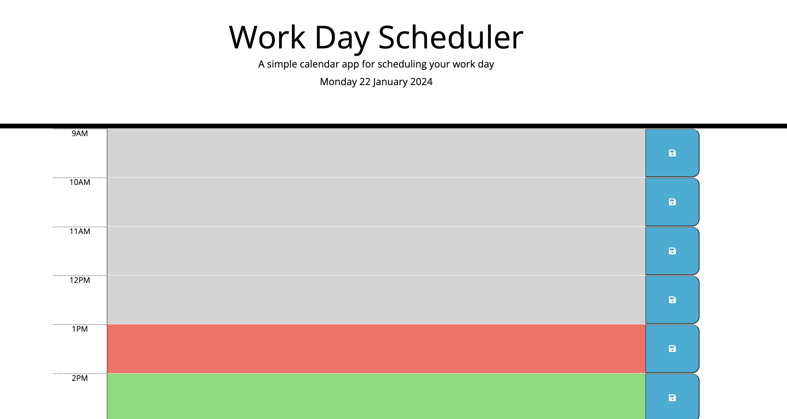

# Work Day Scheduler
Daily Planner

## Description
I have created a workday planner that allows you to save events or tasks for each hour during the working day. This planner is color coded to allow you to easily see past, present and future events/tasks. It can be accessed at https://ramisachowdhury.github.io/work-day-scheduler/

## Installation
N/A

## Usage
Click on any timeblock to input your events or tasks for that hour. Make sure to click the save button to save your edits.

## Credits
The starter code for this challenge was provided by edX web development bootcamp.

## License
Please refer to the LICENSE in the repo-